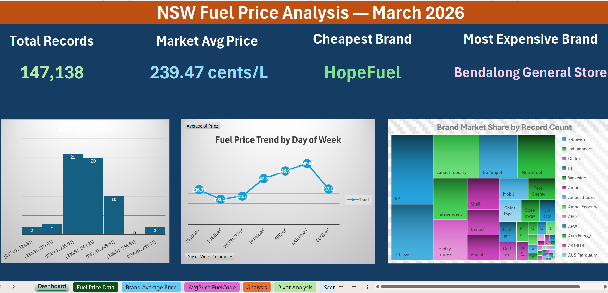

# NSW Fuel Price Analysis – March 2026

*Interactive dashboard summarising 147,138 NSW fuel price records from March 2026.*

An Excel-based analysis of 147,138 NSW fuel price records, built to identify when, where, and with which brands consumers pay the most. The project turns a raw price feed into an interactive dashboard that a buyer, retailer, or policy team could actually use.

## Project Overview

Fuel pricing in NSW shifts daily across thousands of service stations, brands, and fuel types. For most drivers, this complexity is invisible, and small timing decisions quietly add up to real money over the year.

This project explores one full month of pricing data (March 2026) to answer a simple question: where are the patterns, and how much are they worth?

## Key Insights

- Average market price: 239.47 c/L
- Tuesday tends to be the cheapest day to buy fuel
- Saturday shows the highest average prices
- HopeFuel offered the lowest average price across brands, while Bendalong General Store sat at the top end
- Price timing alone can create a difference of around 31 dollars per full tank

## Approach

The workbook covers the full analytical pipeline:

- Data cleaning and preparation of the raw price feed
- Feature engineering, including day of week and price tier classification
- Lookup driven analysis to query any brand, fuel code, or suburb on demand
- Pivot reporting to compare averages across suburbs and weekdays
- Scenario modelling and what-if analysis to quantify best and worst case fill-up costs
- A KPI dashboard summarising the headline numbers

## Files

- `NSW Fuel Price Data.xlsx` – the full workbook, including the dashboard, pivot analysis, lookup panel, scenario summary, and what-if sheets
- `dashboard.png` – preview image of the final dashboard
> Note: Please download the Excel file to view it properly. GitHub's browser preview doesn't support some of the advanced features used in this workbook, such as Scenario Manager.

## Tools

Microsoft Excel, including Pivot Tables, XLOOKUP, INDEX and MATCH, the COUNTIFS family, Scenario Manager, Goal Seek, Data Tables, and charts.

## Data Source

FuelCheck dataset, published by the NSW Government on Data.NSW.

Link: https://data.nsw.gov.au/data/en/dataset/fuel-check

## About

Created as a portfolio project to demonstrate end-to-end analysis in Excel, from raw data to business-ready insight.

## Connect with Me

If you found this project interesting or want to talk data, feel free to reach out.

